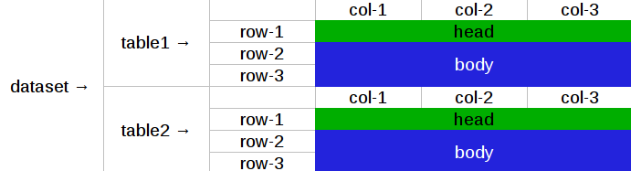

# goodtables

[](https://travis-ci.org/frictionlessdata/goodtables)
[](https://coveralls.io/r/frictionlessdata/goodtables?branch=master)
[](https://pypi.python.org/pypi/goodtables)
[](http://semver.org/)
[](https://gitter.im/frictionlessdata/chat)

Goodtables is a simple utility library to inspect tabular data.

> Version v0.8 has renewed API introduced in NOT backward-compatibility manner. Previous version could be found [here](https://github.com/frictionlessdata/goodtables-py/tree/4b85254cc0358c0caf85bbd41d0c2023df99fb9b).

## Features

- tabular data inspection and validation
- source, structure and schema checks
- support of different input data profiles
- parallel computation for multitable profiles
- builtin command-line interface

## Getting Started

### Installation

```
$ pip install goodtables
```

### Example

Let's start with the simple example:

```python
from goodtables import Inspector

inspector = Inspector()
print(inspector.inspect('data/invalid.csv'))

# will print
#{'time': 0.029,
# 'valid': False',
# 'error-count': 2,
# 'table-count': 1,
# 'errors': [],
# 'tables': [
#    {'time': 0.027,
#     'valid': False',
#     'headers': ['id', 'name', ''],
#     'row-count': 4,
#     'error-count': 2,
#     'errors': [
#        {'row': None,
#         'code': 'blank-header',
#         'message': 'Blank header',
#         'row-number': None,
#         'column-number': 2},
#        {'row': [],
#         'code': 'blank-row',
#         'message': 'Blank row',
#         'row-number': 3,
#         'column-number': None}]}]}
```

### Overview

Goodtables inspects your tabular data to find errors in source, structure and schema. As presented in an example above to inspect data:
- `Inspector(**options)` class should be instantiated
- `inspector.inspect(source, profile='table', **options)` should be called
- a returning value will be a report dictionary

All errors in a report are standartised and described in data quality spec - https://github.com/roll/goodtables-next/tree/master/goodtables/spec.json. Errors are mentioned in order of actual check.

#### Error types

- source - data can't be loaded or parsed
- structure - general tabular errors like duplicate headers
- schema - error of checks against JSON Table Schema

#### Error contexts

- table - the whole table errors like bad encoding
- head - headers errors
- body - contents errors

Contexts and rows/columns coordinates are presented on a figure 1:



### Profiles

Table is a main concept in goodtables. The simplest option is to pass to `Inspector.inspect` path and other options for one table (see example above). But when multitable parallized inspection is needed profiles could be used to process a dataset.

Goodtables supports the following profiles:
- table
- datapackage
- ckan

A profile proceses passed source and options and return it as a dataset containing tables with extras for the following inspection.

#### Custom profiles

> Custom checks is not a part of SemVer versionning. If you use it programatically please pin concrete `goodtables` version to your requirements file.

User could pass to `Inspector.inspect` callable profile to setup custom dataset extraction:

```python
from goodtables import Inspector
from jsontableschema import Table

def custom_profile(source, **options):
    dataset = []
    for table in source:
        dataset.append({
            'table': Table(...),
            'extra': {...},
        })
    return dataset

inspector = Inspector()
inspector.inspect(source, profile=custrom_profile)
```

See builtin profiles to learn more about the dataset extration protocol. A custom profiles feature is experimental and not documented for now.

### Checks

List of checks for an inspection could be customized on `Inspector.inspect` call. Let's explore options on an example:

```python
inspector = Inspector()
inspector.inspect('path.csv', checks='all/structure/schema') # preset
inspector.inspect('path.csv', checks={'bad-headers': False}) # exclude
inspector.inspect('path.csv', checks={'bad-headers': True}) # cherry-pick
```

Check gets input data from framework based on context (e.g. `columns` and `sample` for `head` context) and returns list of errors.

#### Custom checks

> Custom checks is not a part of SemVer versionning. If you use it programatically please pin concrete `goodtables` version to your requirements file.

Inspector accept additonal argument `custom_checks` to insert user defined checks into inspection pipeline (example for `body` context):

```python
from goodtables import Inspector

def custom_check(row_number, columns,  sample):
    errors = []
    for column in columns:
        errors.append({
            'message': 'Custom error',
            'row-number': row_number,
            'column-number': column['number'],
        })
    return errors

inspector = Inspector(checks='structure', custom_checks=[{
    'func': custom_check,
    'after': 'extra-value',
    'code': 'custom-check',
    'type': 'structure',
    'context': 'body',
    'requires': [],
}])
```

User could use one of specification codes to override a standard check. See builtin checks to learn more about checking protocol. A custom checks feature is experimental and not documented for now.

## Documentation

### Inspector

An API definition:

```
Inspector(checks='all',
          custom_checks=[],
          table_limit=10,
          row_limit=1000,
          error_limit=1000,
          order_fields=False,
          infer_fields=False)
    inspect(source, profile='table', **options)
```

### exceptions

The library provides various of exceptions. Please consult with docstrings.

### CLI

> CLI is not a part of SemVer versionning. If you use it programatically please pin concrete `goodtables` version to your requirements file.

All common goodtables tasks could be done using a command-line interface (command per profile):

```
$ python -m goodtables.cli
Usage: cli.py [OPTIONS] COMMAND [ARGS]...

Options:
  --json
  --table-limit INTEGER
  --row-limit INTEGER
  --error-limit INTEGER
  --order-fields
  --infer-fields
  --help                 Show this message and exit.

Commands:
  ckan
  datapackage
  table
```

For example write a following command to the shell:

```
$ python -m goodtables.cli table data/invalid.csv
```

And a report (the same as in the initial example) will be printed to the standard output.

## FAQ

### Is it an inspection or validation?

For now we use `inspector` word because we create reports as result of an inspection. One difference to validation - goodtables will not raise an exception if dataset is invalid.  Final naming is under considiration and based on exposed methods (only `inspect` or like `inspect/validate/stream`).

### Is it possible to stream reporting?

For now - it's not. But it's under considiration. Not for multitable profiles because of parallelizm but for one table it could be exposed to public API because internally it's how goodtables works. Question here is what should be streamed - errors or valid/invalid per row indication with errors etc. We would be happy to see a real world use case for this feature.

## Read More

- [Docstrings](https://github.com/frictionlessdata/goodtables-py/tree/master/goodtables)
- [Changelog](https://github.com/frictionlessdata/goodtables/commits/master)
- [Contribute](CONTRIBUTING.md)

Thanks!
